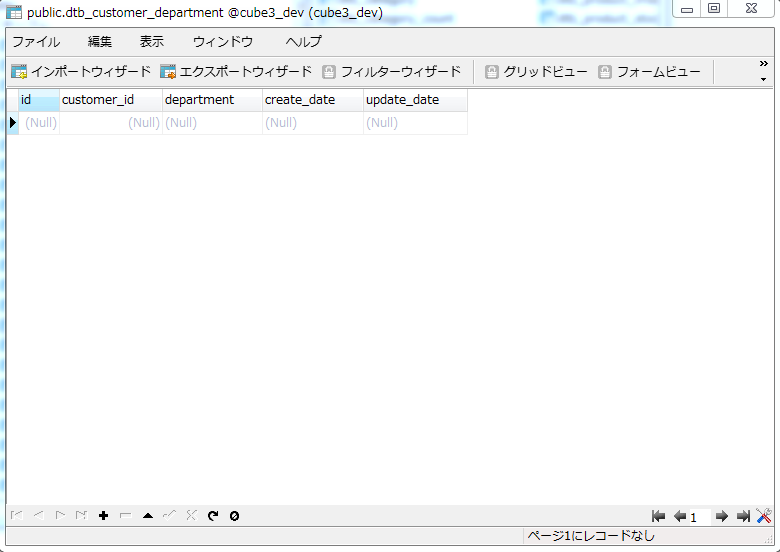

---

# {{ page.title }}

## 本章で行うこと

1. 本章では、管理画面の「会員管理」の登録・編集項目に、項目を追記する方法を説明します。

1. 項目は「部署名」を追加したいと思います。

## カスタマイズで行うこと

1. 専用テーブルの定義

1. 専用テーブル作成マイグレーションファイルの作成

1. データーベース定義ファイルの修正

1. エンティティの修正

1. フォームタイプの修正

1. レポジトリの修正

1. コントローラーの修正

1. サービスの修正

## テーブル定義

- 今回追加項目のテーブルを定義します。

- 以下定義内容です。

- 名称 : drb_customer_department

| 論理名 | 物理名 | データー種別 | データオプション |
|------|------|------|------|
| ID | id | int | PRIMARY KEY AUTO_INCREMANT NOT NULL |
| カスタマーID | customer_id | int | FOREIGN KEY NOT NULL |
| 部署名 | department | varchar(255) | DEFAULT NULL |
| 作成日 | create_date | datetime | NOT NULL |
| 作成日 | update_date | datetime | NOT NULL |

## マイグレーション

### マイグレーションファイルの作成

- コンソールコマンドを開きEC-CUBE3のインストールディレクトリに移動し、以下コマンドを実行します。

```
php app/console migrations:generate
```

- 上記を実行すると以下ディレクトリにマイグレーションファイルの雛形が作成されていると思います。
  - [EC-CUBE3インストールディレクトリ]/src/Eccube/Resource/doctrine/migration

- 作成ファイル
  - **Version20160616144602.php**

  - 以下内容を記述します
  
```
<?php

namespace DoctrineMigrations;

use Doctrine\DBAL\Migrations\AbstractMigration;
use Doctrine\DBAL\Schema\Schema;

/**
 * Auto-generated Migration: Please modify to your needs!
 */
class Version20160616155605 extends AbstractMigration
{
    /**
     * @param Schema $schema
     */
    public function up(Schema $schema)
    {
        if (!$schema->hasTable('dtb_customer_department')) { ★部署名用のリレーションテーブルの有無確認
            $table = $schema->createTable('dtb_customer_department'); ★テーブルがなければ以下テーブル作成
            $table->addColumn('id', 'integer', array(
                'autoincrement' => true,
            ));
            $table->addColumn('customer_id', 'integer', array('NotNull' => true));
            $table->addColumn('department', 'string', array('NotNull' => false, 'length' => 255));
            $table->addColumn('create_date', 'datetime', array('NotNull' => true));
            $table->addColumn('update_date', 'datetime', array('NotNull' => true));
            $table->setPrimaryKey(array('id'));
        }
    }

    /**
     * @param Schema $schema
     */
    public function down(Schema $schema)
    {
        if (!$schema->hasTable('dtb_customer_department')) { ★部署名リレーションテーブルを確認
            $schema->dropTable('dtb_customer_department'); ★部署名リレーションテーブルを削除
        }
    }
}
```

- 上記内容を簡単に説明します。

1.雛形には「up/down」のメソッドが作成されています。

  - [upメソッド]
    - 本ファイルを基準としてDBを最新に更新する処理を記述

  - [downメソッド]
    - 本ファイルを基準としてDBを前の状態に戻すための処理を記述

2.upメソッドの引数「$schema」オブジェクトを用いて、テーブル操作を行います。

3以下がメソッドの説明一覧です。

---

| メソッド名称 | 引数 | 戻り値 | メソッド機能 |
|------|------|------|------|
| hasTable | 対象テーブル物理名称 | テーブルオブジェクト | 引数で与えられたテーブルが存在するか確認 |
| createTable | 作成テーブル物理名称 | boolean | 引数で与えられたテーブルを作成する |
| addColumn | 作成カラム定義(連想配列) | - | 引数で与えられた情報でカラムを追加する |
| setPrimaryKey | プライマリキーとなるカラム名称(連想配列) | - | 引数で受け取ったカラムに対してプライマリキーの設定を行う |
| dropTable | 対象テーブル名称 | boolean | 引数で与えられたテーブルを削除する |

---

4.上記のメソッドを用い、前述のテーブルを定義しています。

5.テーブルの有無により「up/down」の処理でエラーが発生する可能性があるために、hasTableで確認後、処理を行なっています。

### マイグレーションファイルの実行

- 上記記述が完了したら、以下のフォルダに移動し、マイグレーションのコマンドで、テーブルを作成します。
  - [EC-CUBE3インストールディレクトリ]/src/Eccube/Resource/doctrine/migration

  - コマンド

  ```
  php app/console migrations:migration
  ```

  - マイグレーションが実行され、以下の様にテーブルが作成されているはずです。

  ---

  

  ---

## リレーション設定(dcm.ymlの修正)

### Eccube.Entity.Customer.dcm.ymlの修正

- Eccube.Entity.Customer.dcm.ymlに作成したテーブルとのリレーション情報を定義します。

- 以下ディレクトリに移動します。
  - /src/Eccube/Resource/doctrine

- 以下ファイルを開き、「oneToMany:」の一番最後に以下を追記します。
  - Eccube.Entity.Customer.dcm.yml

```
        CustomerDepartment:
            targetEntity: Eccube\Entity\CustomerDepartment
            mappedBy: Customer
    lifecycleCallbacks: {  }
```

- 上記の説明を簡単に行います。

1. **CustomerDepartment**
  - リレーションの名称です(テーブル名をアッパーキャメルで定義します)

1. **targetEntity**
  - 対象のエンティティを指定する。
  - 今回のエンティティは、後で作成します。

1. **mappedBy**
  - マップする対象のエンティティ(1:nの1側)を指定します。
  - 今回は**Customer**となります。

### dtb_customer_departmentのテーブルスキーマ定義ファイルを作成する

- まずは、テーブル定義を参考に、今回作成したテーブルのテーブルスキーマ定義ファイルを作成します。

- 以下フォルダに作成します。
  - /src/Eccube/Resource/docrine

- 作成ファイル名
  - Eccube.Entity.CustomerDepartment.dcm.yml

  - 以下が記述内容です。

```
Eccube\Entity\CustomerDepartment:
    type: entity
    table: dtb_customer_department
    repositoryClass: Eccube\Repository\CustomerDepartmentRepository
    id:
        id:
            type: integer
            nullable: false
            unsigned: false
            id: true
            column: id
            generator:
                strategy: AUTO
    fields:
        department:
            type: text
            nullable: true
        create_date:
            type: datetime
            nullable: false
        update_date:
            type: datetime
            nullable: false
    manyToOne:
        Customer:
            targetEntity: Eccube\Entity\Customer
            inversedBy: CustomerDepartment
            joinColumn:
                name: customer_id
                referencedColumnName: customer_id
    lifecycleCallbacks: {  }
```

- 上記簡単に説明を行います。

1. **Eccube\Entity\CustomerDepartment:**
  - 後で作成するエンティティ名称を定義します。

1. **type:**
  - entityを指定してくさい。

1. **table:**
  - 本ファイルの対象テーブル名を定義します。

1. **repositoryClass:**
  - 後に作成する、レポジトリのクラス名を定義します。

1. **id:**
  - プライマリーキーに関連する情報を定義します。
  - ※詳細はチュートリアル等を参考としてください。

1. **fields:**
  - プライマリキー以外のカラムの定義を行います。
  - ※詳細はチュートリアル等を参考としてください。

1. **manyToOne:**
  - 本ファイルを基準として、の1:NのNを指定します。
  - targetEntity: 対象エンティティを定義します。
  - inversedBy: 1:Nの1側のカラム名を定義します(次の項で追加します)。
  - joinColumn: 結合するカラム名を指定します。
   - name: 対象先のカラム名です。
   - referencedColumnName: 情報取得時のカラム名称です(エイリアス)。

### CustomerEntityの修正

- 前項でリレーション定義が完了しました。

- 前項の**manyToOne:**の定義にあわせてCustomerEntityを修正します。

- 以下のファイルを修正します。
 - /src/Eccube/Entity/CustomerEntity.php

- 以下修正箇所です

```


```

### 対象エンティティの作成

- 先程**Eccube.Entity.Customer.dcm.yml**に定義したエンティティファイルを作成します。

- まずはコンソールコマンドを用いて雛形(リレーション設定を除く)を作成します。

  1. インストールディレクトリに移動し、以下コマンドを実行します。

  - コマンド

  ```
  php ./vendor/bin/doctrine orm:generate:entities --extend="Eccube\Entity\AbstractEntity" src
  ```

  - 以下フォルダを確認します。
    - /src/Eccube/Entity

  - 以下ファイルに定義を行います。
    - CustomerDepartment.php

```
<?php
/*
 * This file is part of EC-CUBE
 *
 * Copyright(c) 2000-2015 LOCKON CO.,LTD. All Rights Reserved.
 *
 * http://www.lockon.co.jp/
 *
 * This program is free software; you can redistribute it and/or
 * modify it under the terms of the GNU General Public License
 * as published by the Free Software Foundation; either version 2
 * of the License, or (at your option) any later version.
 *
 * This program is distributed in the hope that it will be useful,
 * but WITHOUT ANY WARRANTY; without even the implied warranty of
 * MERCHANTABILITY or FITNESS FOR A PARTICULAR PURPOSE.  See the
 * GNU General Public License for more details.
 *
 * You should have received a copy of the GNU General Public License
 * along with this program; if not, write to the Free Software
 * Foundation, Inc., 59 Temple Place - Suite 330, Boston, MA  02111-1307, USA.
 */


namespace Eccube\Entity;

use Eccube\Common\Constant;
use Eccube\Util\EntityUtil;

/**
 * CustomerDepartment
 */
class CustomerDepartment extends \Eccube\Entity\AbstractEntity
{
    /**
     * @var integer
     */
    private $id;

    /**
     * @var string
     */
    private $department;
    /**
     * @var \DateTime
     */
    private $create_date;

    /**
     * @var \DateTime
     */
    private $update_date;

    /**
     * @var \Eccube\Entity\Customer
     */
    private $Customer;

    /**
     * Get id
     *
     * @return integer
     */
    public function getId()
    {
        return $this->id;
    }

    /**
     * Set department
     *
     * @param  string $department
     * @return $this
     */
    public function setDepartment($department)
    {
        $this->department = $department;

        return $this;
    }

    /**
     * Get department
     *
     * @return string
     */
    public function getDepartment()
    {
        return $this->department;
    }

    /**
     * Set create_date
     *
     * @param  \DateTime $createDate
     * @return Order
     */
    public function setCreateDate($createDate)
    {
        $this->create_date = $createDate;

        return $this;
    }

    /**
     * Get create_date
     *
     * @return \DateTime
     */
    public function getCreateDate()
    {
        return $this->create_date;
    }

    /**
     * Set update_date
     *
     * @param  \DateTime $updateDate
     * @return Order
     */
    public function setUpdateDate($updateDate)
    {
        $this->update_date = $updateDate;

        return $this;
    }

    /**
     * Get update_date
     *
     * @return \DateTime
     */
    public function getUpdateDate()
    {
        return $this->update_date;
    }

    /**
     * Set Customer
     *
     * @param  \Eccube\Entity\Customer $customer
     * @return Order
     */
    public function setCustomer(\Eccube\Entity\Customer $customer = null)
    {
        $this->Customer = $customer;

        return $this;
    }

    /**
     * Get Customer
     *
     * @return \Eccube\Entity\Customer
     */
    public function getCustomer()
    {
        if (EntityUtil::isEmpty($this->Customer)) {
            return null;
        }
        return $this->Customer;
    }
}
```

- 上記の簡単な説明を行います。

1. エンティティファイルは、データーベースカラムをメンバ変数として定義します。

1. メンバ変数のスコープは、protectedで定義します。

1. リレーション様に、カスタマーオブジェクトを保持するためのメンバ変数も定義します。

1. 各メンバに対して、ゲッター・セッターを定義します。

## フォームの項目追加

### フォームタイプの修正

- 会員管理登録・編集画面で利用されているフォームタイプに、部署名の項目を追加します。

- 以下が対象ファイルです。
 - /src/Eccube/Form/Type/Admin/CustomerType.php

- 下記の様に修正を加えます。
 - 今回は会社名の下に追記します。

```
->add('department', 'text', array(
    'required' => false,
    'constraints' => array(
        new Assert\Length(array(
            'max' => $config['stext_len'],
        ))
    ),
))
```

- 上記の簡単な説明を行います。

1. フォームビルダーのaddメソッドで、name属性、type属性、必須、バリデーションを定義しています。

