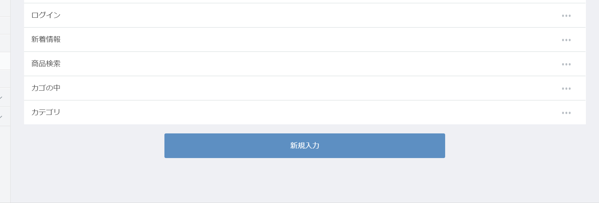
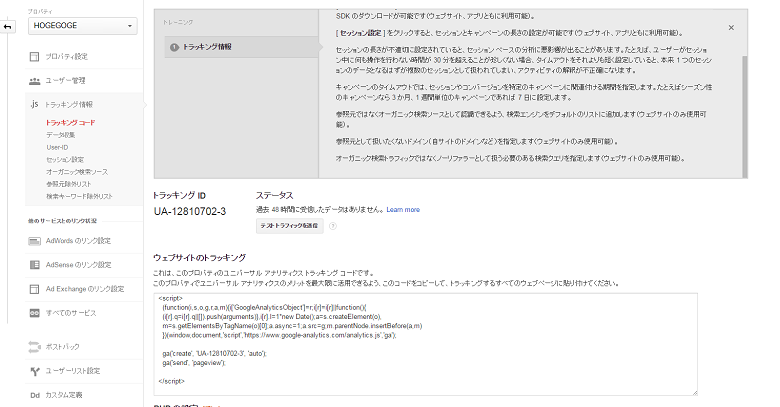
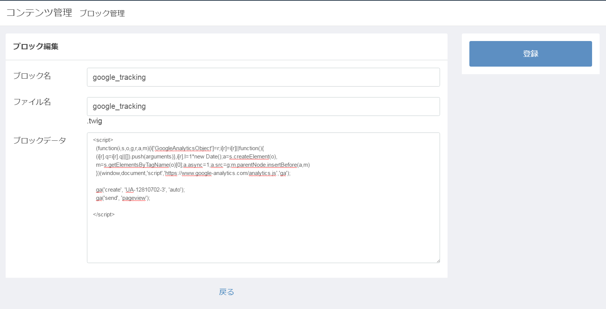
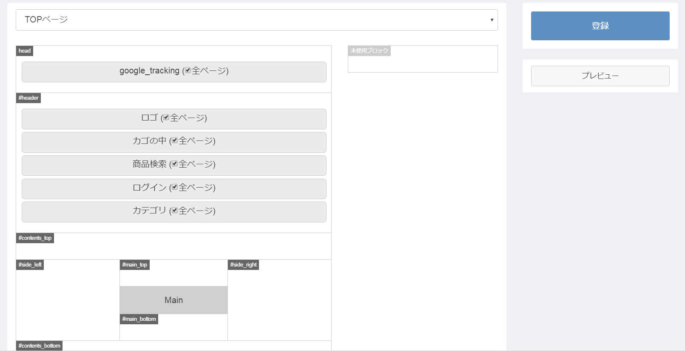
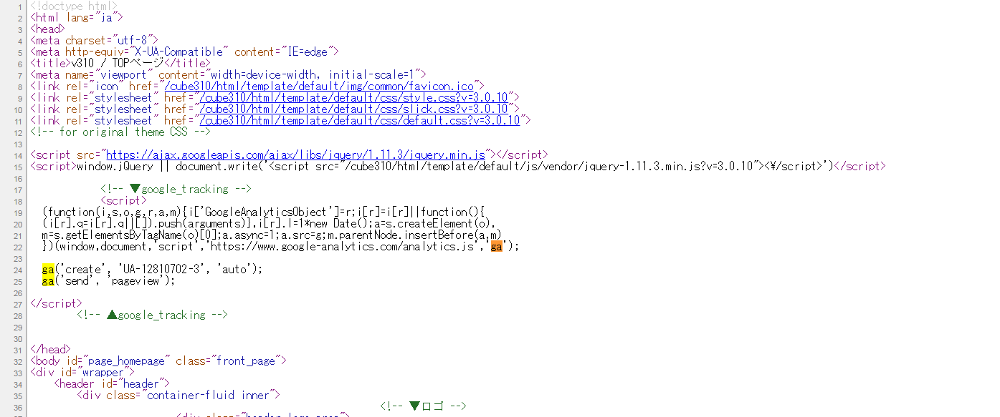
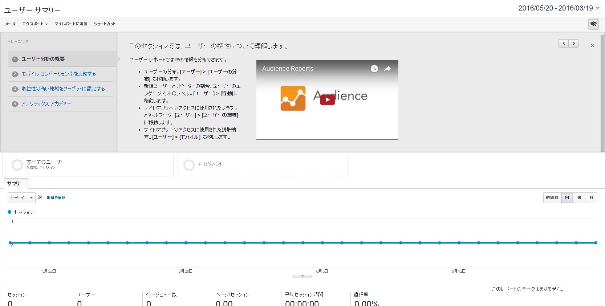
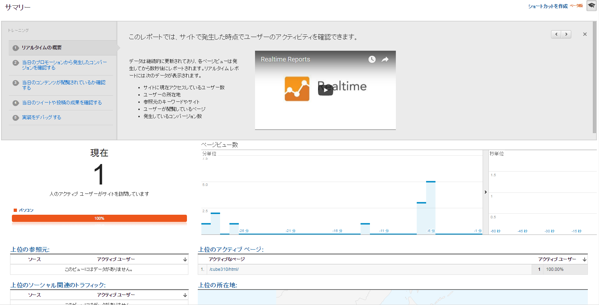
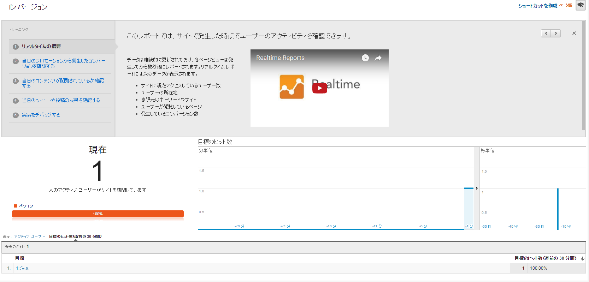

---

# {{ page.title }}

## 本章で行うこと

管理画面の「ブロック管理」機能を利用して、GoogleAnalyticsタグを設置する方法を説明します。

## カスタマイズで行うこと

1. ブロックの追加

1. ページレイアウト編集

1. GoogleAnalyticsでの確認

1. コンバージョンの設定

1. GoogleAnalyticsでの確認

## 前提条件

1. GoogleAnalyticsのアカウントは事前に取得しているものとします。

1. 該当GoogleAnalyticsアカウントで事前にサイト登録が完了しているものとします。

1. 事前にGoogleAnalyticsアカウントで、「トラッキングタグ」を発行しているものとします。

## ブロックの追加

- 管理画面にログインし、ブロックを追加していきます。

1.管理画面メニュー > コンテンツ管理 > ブロック管理をクリックします。

2.ブロック管理画面の「新規入力」ボタンを押下します。

---

---

3.GoogleAnalyticsのトラッキングタグ取得ページにアクセスして、トラッキングタグをコピーします。

- ブロック名・Twig名は任意で入力します。

---

---

---

---

4.コピー後、登録ボタンを押下し、ブロック登録を完了します。

## ページレイアウト編集

1.管理画面メニュー > コンテンツ管理 > ページ管理をクリックします。

2.表示されたページの最上段「TOPページ」行、右横の「・・・」内メニュー「レイアウト編集」をクリックします。

3.以下レイアウト管理画面の様に、画面右部の「未使用ブロック」内に作成したブロックが表示されています。

4.「全ページ」にチェックをつけ、画面左部分の「head」の位置へドラッグ&ドロップを行います。

---

---

5.「登録ボタン」を押下して登録を完了します。

6.ユーザー画面、「TOPページ」を開き、ページのソースを表示し「トラッキングタグ」を確認します。

---

---

## コンバージョン画面の設定

- 購入完了画面を対象画面とします。

1.GoogleAnalytics管理画面にアクセスします。

2.メニュー「アナリティクス設定」をクリックします。

3.ビュー欄、「目標」をクリックします。

4.「目標設定」で「テンプレート・注文」「タイプ」は到達ページ、「目標の詳細」の「到達ページ」には「/[EC-CUBE 3インストールディレクトリ]/html/shopping/complete」の「正規表現」を設定します。

## GoogleAnalyticsでの確認

### トラックングタグ確認

1.EC-CUBE 3のトップページに遷移後、GoogleAnalyticsのメニュー「レポート」をクリックします。

---

---

2.画面左メニュー「リアルタイム > サマリー」をクリックし、以下の様にアクティブユーザーが「1」になっていれば、設定は成功です。

---

---

### コンバージョン確認

1.EC-CUBE 3ユーザー画面で購入完了を終えます。

8.GoogleAnalyticsの画面左メニュー「リアルタイム > コンバージョン」をクリック

9.画面下部の目標のヒット数が「100.00%」になっていれば、設定成功です。

---

