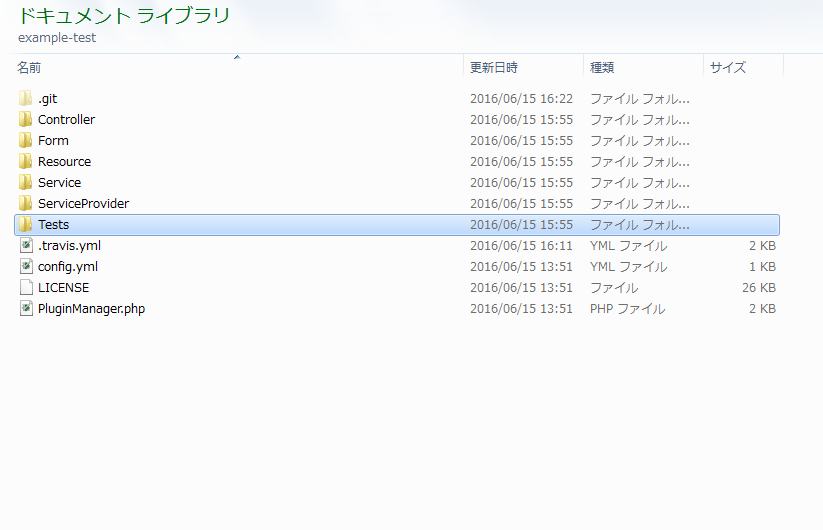
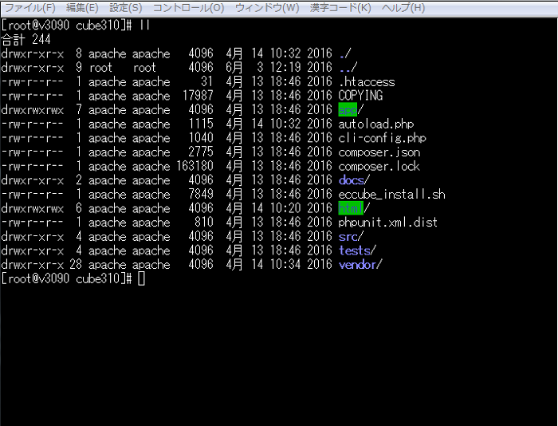
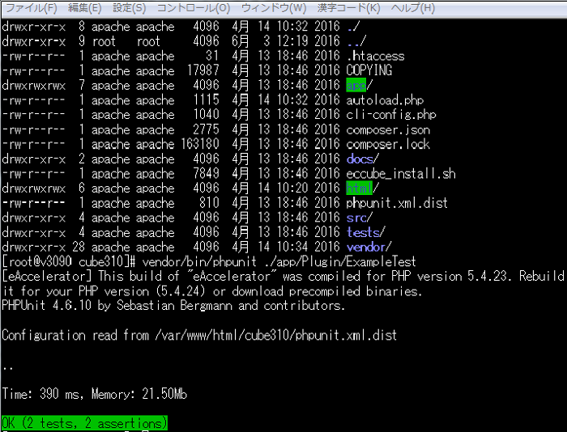

---

# {{ page.title }}

## テストの作成

- プラグイン作成においても、EC-CUBEのテストクラスの継承を行えば、単体テストを比較的容易に作成できます。

- 本章では、簡単なプラグインを例に「テストの作成・自身のレポジトリ上へプッシュ」した際の継続的インテグレーションの利用方法を説明します。

### テストの目的

- EC-CUBE本体のバージョンアップ時に動作するかどうかを確認します。

- 継続的インテグレーションを用いプラグインの改修時にEC-CUBEの過去バージョンで動作するかを確認します。

### 単体テスト手順

1. ローカルでテストコードを作成する

1. ローカルでユニットテストを実行し、問題がないことを確認する。

1. 自身のGitHubレポジトリにプッシュ。

1. EC-CUBE 3の対象環境に適合しているか確認するために「Travis」を用いてテストを行う。

### 前提

1. プラグインは事前に作成されており、インストール・アンインストール、基本機能は動作確認済みとします。

1. 今回は以下に例としてのプラグインを作成しています。

1. 以下をクローンして、参考としてください。
  - <a href="https://github.com/EC-CUBE/ExamleTest" target="_blank">ExampleTestプラグイン</a>

1. 今回のテスト対象は上記レポジトリの「ExampleService.php」というサービスクラスが対象となります。

### テスト対象ファイル機能

1. 「ExamleService.php」内のメソッド「getPluginInstallDateFormatJa」が対象メソッドです。

1. 引数にプラグインのコードを渡すと、そのプラグインがインストールされた日付を**dtb_plugin**から取得します。

1. 該当コードのプラグインが見つからない際は、falseを返却します。

### テストファイルの作成

1.以下の様にフォルダを作成してください。

  - /app/Plugin/[自身で作成したプラグインフォルダ名]/Tests/Service
  - フォルダの作成方法は環境で変わるため、割愛させていただきます。
  - フォルダ内もプラグインのルートディレクトリ構造と同様に、Serviceなどであれば、Serviceフォルダを生成してください。
  - 今回例では、以下フォルダ直下に作成しています。

  ---

  

  ---

2.次にファイルを作成します。

  - 以下手順に添って作成してください。
  - 今回例ではサービスのテストのみ作成するため、以下のファイルをコピー・リネームしてください。
    - [EC-CUBEインストールディレクトリ]/tests/Eccube/Tests/Service/ShoppingServiceTest.php
  - コピー後setUpやtearDownなど初期化・終了時処理のメソッドを除き全て削除します。

3.以下のファイルを作成済みの**/app/Plugin/[自身で作成したプラグインフォルダ名]/Tests/Service**にコピーします。

  - 以下の様に修正・メソッドの追記を行います。

<script src="http://gist-it.appspot.com/https://github.com/EC-CUBE/ec-cube.github.io/blob/master/Source/plugin_test/ExampleServiceTest.php"></script>

<!--
```
<?php

/*
 * This file is part of the ExampleTest
 *
 * Copyright (C) 2016 LockOn
 *
 * For the full copyright and license information, please view the LICENSE
 * file that was distributed with this source code.
 */

namespace Plugin\ExampleTestPlugin\Tests\Service; ★テストファイルの名前空間を記述

use Eccube\Tests\EccubeTestCase;
use Plugin\ExampleTestPlugin\ServiceProvider\ExampleTestServiceProvider; ★テスト対象ファイルの名前空間定義

class ExampleServiceTest extends EccubeTestCase ★クラス名称を修正
{
    public function setUp() ★テスト開始時に行う処理があれば記述
    {
        parent::setUp();
    }

    /**
     * プラグインのインストール時間取得メソッド失敗パターンのテスト
     * ・インストールされていないコードをサービスに渡す
     * ・戻り値としてfalseが返却される
     */
    public function testGetPluginInstallDateFormatJaFromErrorCode() ★まず正常系エラーのメソッドを追記します
    {
        $errorCode = 'Test'; ★インストールされていないプラグインコードを設定
        $this->actual = $this->app['eccube.plugin.service.example']->getPluginInstallDateFormatJa($errorCode); ★取得値はactualに格納

        $this->assertFalse($this->actual); ★falseが返却される事を定義
    }

    /**
     * プラグインのインストール時間取得メソッド成功パターンのテスト
     * ・インストールされているコードをサービスに渡す
     * ・事前にメソッドと同じ条件でデーターベースからインストール日付を取得しておく
     * ・戻り値としてインストール日付が返却される
     */
    public function testGetPluginInstallDateFormatJaFromSuccessCode() ★次は正常系の正常値テストのメソッドを追記します
    {
        $successCode = 'ExampleTest'; ★今回インストールしたプラグインのコードを記述します

        $qb = $this->app['orm.em']->createQueryBuilder(); ★テスト対象のサービスで取得する値を手動で取得します。
        $qb->select('p.create_date')
            ->from('\Eccube\Entity\Plugin', 'p')
            ->where('p.code = :Code')
            ->setParameter('Code', $successCode);

        try {
            $date = $qb->getQuery()->getSingleResult();
            $this->expected = $date['create_date']->format('Y年m月d日 H時i分s秒'); ★比較値をexpectedに格納します
        } catch (\NoResultException $e) {
            throw new \NoResultException();
        }

        $this->actual = $this->app['eccube.plugin.service.example']->getPluginInstallDateFormatJa($successCode); ★取得値をactualに格納します

        $this->assertEquals($this->actual, $this->expected); ★actualとexpectedが同一である事を定義
    }
}
```
-->

- 上記の説明を行います。

    1. コピー後、編集ファイルの名前空間の修正を行います。
    - 今回作成するファイルの格納フォルダを指定してください。

    1. 今回テスト対象の、ExampleServiceの名前空間を指定します。

    1. クラス名を、今回テスト対象ファイルのあわせて変更します。

    1. メソッドを追加します。
    - はじめに正常系のエラーテストを追加しています。
    - 次に正常系のテストを追加しています。

#### 備考

  - 本章では、テストコードの書き方については、一切説明を行いません。
  - 以下を参考に作成を行なってください。
  - <a href="http://qiita.com/chihiro-adachi/items/f2fd1cbe10dccacb3631" target="_blank">EC-CUBE 3のメモ - ユニットテスト -</a>

### ローカルでのテストの実行

- ここまでの作業でテストが作成できました。
- 一度ローカルで確認して、単一環境で機能として問題ないか確認をおこないます。

  1.コンソールを起動する。

  - ご自身の環境に合わせたコンソールを起動してください。
  - ※Windows環境であれば、環境パスに、PHPの実行パスは指定済みとします。

  2.以下の様に**EC-CUBE 3のインストールディレクトリ**に移動してください。

---



---

  3.以下コマンドを実行します。

```
vendor/bin/phpunit ./app/Plugin/[自身で作成したプラグインのフォルダ名]
```

- 内容が正しければ、以下の様な内容が表示されるはずです。


---



---

### 継続的インテグレーションを使った複数環境でのテスト

- 前項で問題がなければ、自身のGitHub環境にプッシュし、継続的インテグレーションを提供する、「Travis」で複数環境でのテストをおこないます。

#### Travis設定ファイルの作成

1.プラグインのルートディレクトリに**.travis.yml**を作成します。

2.今回の例では以下フォルダが該当です。

  - [EC-CUBE 3インストールディレクトリ]/app/Plugin/ExampleTest

3.フォルダ内にファイルを作成し、以下を記述します。

  - 変更が必要な箇所のみ★印を付与して説明しています。

  - .travis.yml

<script src="http://gist-it.appspot.com/https://github.com/EC-CUBE/ec-cube.github.io/blob/master/Source/plugin_test/Travis.yml"></script>

<!--
```

language: php

sudo: false

cache:
  directories:
    - $HOME/.composer/cache
    - /home/travis/.composer/cache

php: ★テスト対象のPHPバージョンを指定します
  - 5.3
  - 5.4
  - 5.5
  - 5.6
#  - 7.0

env:
  # plugin code
  global:
    PLUGIN_CODE=ExampleTest ★作成したプラグインのコードを指定します
  matrix:
#    # ec-cube master ★EC-CUBE 3のバージョンを指定します
#    - ECCUBE_VERSION=master DB=mysql USER=root DBNAME=myapp_test DBPASS=' ' DBUSER=root
#    - ECCUBE_VERSION=master DB=pgsql USER=postgres DBNAME=myapp_test DBPASS=password DBUSER=postgres
    - ECCUBE_VERSION=3.0.9 DB=mysql USER=root DBNAME=myapp_test DBPASS=' ' DBUSER=root
    - ECCUBE_VERSION=3.0.9 DB=pgsql USER=postgres DBNAME=myapp_test DBPASS=password DBUSER=postgres
    - ECCUBE_VERSION=3.0.10 DB=mysql USER=root DBNAME=myapp_test DBPASS=' ' DBUSER=root
    - ECCUBE_VERSION=3.0.10 DB=pgsql USER=postgres DBNAME=myapp_test DBPASS=password DBUSER=postgres

matrix:
  fast_finish: true

before_script: ★Travisを初期化しています
  # archive plugin
  - tar cvzf ${HOME}/${PLUGIN_CODE}.tar.gz ./*
  # clone ec-cube
  - git clone https://github.com/EC-CUBE/ec-cube.git
  - cd ec-cube
  # checkout version
  - sh -c "if [ ! '${ECCUBE_VERSION}' = 'master' ]; then  git checkout -b ${ECCUBE_VERSION} refs/tags/${ECCUBE_VERSION}; fi"
  # update composer
  - composer selfupdate
  - composer install --dev --no-interaction -o
  # install ec-cube
  - sh eccube_install.sh ${DB} none
  # install plugin
  - php app/console plugin:develop install --path=${HOME}/${PLUGIN_CODE}.tar.gz
  # enable plugin
  - php app/console plugin:develop enable --code=${PLUGIN_CODE}

script: ★プラグインをインストールしています
  # exec phpunit on ec-cube
  - phpunit app/Plugin/${PLUGIN_CODE}/Tests

after_script: ★プラグインの、インストール・アンインストール、有効化・無効化のテストを行なっています
  # disable plugin
  - php app/console plugin:develop disable --code=${PLUGIN_CODE}
  # uninstall plugin
  - php app/console plugin:develop uninstall --code=${PLUGIN_CODE}
  # re install plugin
  - php app/console plugin:develop install --code=${PLUGIN_CODE}
  # re enable plugin
  - php app/console plugin:develop enable --code=${PLUGIN_CODE}
```
-->

- 上記の設定項目内容を以下に説明します。

1. [php：]
  - phpの各バージョンを設定します。
  - 組み合わせ数が多くなるため、5.3と5.6のみなど、ある程バージョンを絞る方が適切です。

1. [env：> global：]
  - PLUGIN_CODEの右辺に作成したプラグインのコードを指定します。

1. [env：> matrix：]
  - テストのマトリクスの指定です。
  - ここでEC-CUBEの各バージョンを設定します。

1. [befoe_script：]
  - プラグインのユニットテストを実行するまでの前準備です。
    - 処理フローは以下となります。
      - プラグインをパッケージング(tarでアーカイブ)
      - ec-cube本体をclone
      - envで指定したec-cube本体のバージョンにcheckout
      - ec-cube本体のインストール
      - プラグインのインストール

1. [script：]
  - phpユニットテストを実行しています。
  - ここでインストールされたプラグインに内包されているユニットテストが実行されます。

- 以下にTravisの設定ファイルの参考を記述しておきますので、参考としてください。

- <a href="https://github.com/EC-CUBE/coupon-plugin/blob/master/.travis.yml" target="_blank">.travis.yml(参考)</a>

#### travis-ciとgithubの連携

- GitHubにログイン済みの状態で以下にアクセスし、連携をONにします。

- <a href="https://travis-ci.org/profile/EC-CUBE" target="_blank">Travis</a>

- 表示されているレポジトリの一覧から、該当レポジトリのボタン表示をスライドさせ緑色でONの状態で連携完了です。


#### Gitへのプッシュ

- 完了したら、自身のレポジトリにプッシュを行うと自動でTravisが稼働し、テストを行います。

- テスト結果はGitHubとTravisを設定したページで確認できます。
